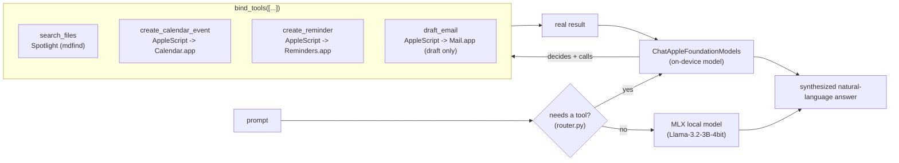

# private-agent

A private, on-device agentic assistant for macOS. Ask it to find a file, create a calendar event, set a reminder, or draft an email -- it decides which action to take and does it, entirely on your Mac.


Runs on Apple's on-device Foundation Models via [langchain-apple-foundation-models](https://github.com/rajanshxrma/langchain-apple-foundation-models) -- no API key, no network call, nothing leaves the machine.

## Install

**Menu bar app (no Python required):** grab `Private-Agent-macOS.zip` from the [latest release](https://github.com/rajanshxrma/private-agent/releases/latest), unzip, and drag `Private Agent.app` to Applications.

It's unsigned (no Apple Developer account behind this yet), so the first launch needs one extra step: right-click the app -> **Open** -> **Open** in the dialog that follows (or System Settings -> Privacy & Security -> "Open Anyway" if macOS blocks it outright). After that first launch it opens normally.

**From source:**

```
pip install -e .
private-agent "find my resume"
```

Or run it as a menu bar app:

```
private-agent-menubar
```

Requires macOS 26+ with Apple Intelligence enabled, Apple Silicon.

## What it can do

| Tool | Backing implementation |
|---|---|
| Search files by name | Spotlight (`mdfind -name`), scoped to Downloads/Documents/Desktop |
| Create a calendar event | AppleScript -> Calendar.app |
| Create a reminder | AppleScript -> Reminders.app |
| Draft an email | AppleScript -> Mail.app -- creates a draft only, **never sends** |

The on-device model decides which tool (if any) to call based on your prompt, executes it, and gives you back a plain-language confirmation of what it did.

## Architecture



Each tool is a plain Python function; the on-device model's tool-calling introspects the function signature and docstring to know what arguments to pass -- no manual JSON-schema authoring.

### Why there's a router

The two backends have very different tradeoffs (see benchmarks below): the on-device model has real, tested tool-calling; MLX is ~5x faster but has no tool-execution loop built for it here. MLX's chat template *can* express tool-call prompts (Llama-3.2's template accepts a `tools` argument), but using that would mean parsing potentially malformed JSON output and building a full tool-execution round trip from scratch -- real, doable work for a future version, not something to bolt on under time pressure.

So `router.py` uses a deliberately simple keyword classifier: if the prompt plausibly needs one of this agent's real tools (mentions finding/searching, scheduling, reminders, or email), it goes to the on-device model. Otherwise, it goes to MLX for a faster plain answer. No extra LLM call to decide routing -- that would spend more time than the routing saves.

## Multi-turn conversations

The menu bar app remembers context across successive "Ask..." calls, so a follow-up like "actually, make it 3pm instead" works without repeating the whole request. Use the **New Conversation** menu item to drop that context and start clean.

The two backends carry that memory very differently, because of how each one actually works:

- **On-device (tool) backend:** `ChatAppleFoundationModels` tracks conversation history itself, inside Apple's own on-device Session object -- replaying LangChain message history back into it does nothing, since the provider only ever reads a leading system message and the final human message off what's passed to `invoke()`. So `conversation.py` gets multi-turn memory here for free, just by reusing the same bound agent instance across turns instead of rebuilding it per call.
- **MLX backend:** has no persistent session of its own, so memory here means literally replaying the full prior exchange through the chat template on every call (`router.run_mlx`'s `history` argument).

One consequence of the on-device model owning its own history: once a conversation uses a real tool even once, every later turn in that conversation keeps going to the on-device backend, even if a later message has no tool keyword at all ("nevermind, that one's done" has nothing for the router to match on, but only the on-device session has the context to act on it). See Known limitations below for what this doesn't cover.

## Benchmarks (M1, 16GB RAM -- measured, not estimated)

Small samples of this on-device model were wildly inconsistent run to run (0.3s-6.8s, occasional hangs) with no clear cause. A 20-call single-session sample resolved it into a real, repeatable number:

| Backend | Median | Mean | Range | Sample |
|---|---|---|---|---|
| Apple on-device Foundation Model | 6.58s | 6.29s | 3.52s - 6.78s | 20 calls, short prompt |
| MLX local (`Llama-3.2-3B-Instruct-4bit`) | 1.34s | 1.40s | 1.27s - 1.68s | 10 calls, 50 tokens |

MLX is meaningfully faster and far more consistent for this workload on this hardware -- worth factoring in if latency matters more than using Apple's own on-device model specifically. The on-device Foundation Model's 20-call sample also showed 2 consecutive unexplained faster outliers (~3.5s) breaking an otherwise tight ~6.5-6.6s cluster; small samples (3-5 calls) would have reported anywhere from 0.3s to a full timeout depending on when you happened to measure.

## Evals (63 real trials, not anecdotes)

`scripts/eval_agent.py` runs real prompts through the real on-device model across all four tools, verifying and cleaning up every artifact it creates. Two things worth knowing before you trust this agent with a real date:

| Metric | Result |
|---|---|
| Overall tool-selection accuracy | 59/63 (94%) |
| `create_reminder` tool-selection accuracy | 46/48 (96%) |
| `create_calendar_event` tool-selection accuracy | 8/9 (89%) |
| `search_files` tool-selection accuracy | 5/6 (83%) |
| Date-format drift (non-MM/DD/YYYY sent for a due/start date) | 48/54 (89%) |

The date-format number is the important one. It's not just plain-language dates like "today" -- the model frequently computes its own specific `YYYY-MM-DD` date and gets it flat wrong (dates in 2024-2025 were common outputs in a July 2026 test run), and sometimes invents a due date when the prompt never mentioned one at all. `tools/_dates.py` handles this by refusing to trust anything it can't verify: a small set of relative phrases (`today`, `tomorrow`, `next week`, `this weekend`, `in N days`) get computed from the real system clock; anything else -- including a plausible-looking `YYYY-MM-DD` -- is dropped rather than risked. A reminder with no due date is a much smaller problem than one confidently set on the wrong day.

Full writeup on this finding: [`docs/eval-findings.md`](docs/eval-findings.md).

## Known limitations (found by actually testing this, not guessed)

- **The on-device model can't be trusted to compute its own dates.** See Evals above -- `_dates.py`'s reject-if-unrecognized policy trades some false negatives (a legitimately unusual but correct date format gets dropped too) for eliminating silently-wrong dates, which is the worse failure mode of the two.
- **File search is scoped to Downloads/Documents/Desktop, not the whole disk.** A naive Spotlight query with no scoping returns full-text matches from every indexed file on the machine, including code comments inside installed libraries -- try searching "resume" with no scoping and you'll get pytest internals before your actual resume.
- **AppleScript automation on Reminders.app gets slow at scale.** Filtered queries and deletes against a list with 2000+ items can take tens of seconds -- this is a real characteristic of the scripting bridge at scale, not something this tool can fix.
- **Mail drafts persist even if you close the compose window without saving.** Mail.app auto-saves visible compose windows to Drafts on its own schedule -- this is actually the desired behavior (you want to find your draft later), just worth knowing if you're testing.
- **Starting a conversation on MLX, then needing a tool, loses context.** See Multi-turn conversations above -- the on-device model has no visibility into anything said on MLX, since they're different models with no shared memory. Once a conversation touches the tool backend it stays there for the rest of that conversation to avoid the reverse problem.
- **Doesn't yet use Apple's newer WWDC26 APIs** (the `LanguageModel` protocol for multi-model routing, `DynamicProfile` for multi-agent workflows, image input) -- those require a beta OS/SDK combination not yet stable enough to depend on for a working demo. Built entirely on the stable, public Foundation Models API.

## License

MIT
