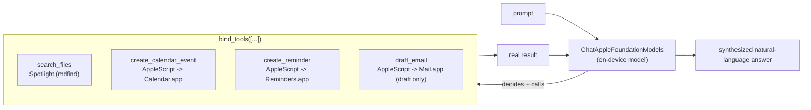

# private-agent

A private, on-device agentic assistant for macOS. Ask it to find a file, create a calendar event, set a reminder, or draft an email -- it decides which action to take and does it, entirely on your Mac.

```
private-agent "find my resume"
private-agent "remind me to submit the internship application tomorrow"
```

Runs on Apple's on-device Foundation Models via [langchain-apple-foundation-models](https://github.com/rajanshxrma/langchain-apple-foundation-models) -- no API key, no network call, nothing leaves the machine.

## Install

```
pip install -e .
private-agent "find my resume"
```

Or run it as a menu bar app:

```
private-agent-menubar
```

Requires macOS 26+ with Apple Intelligence enabled, Apple Silicon.

## What it can do

| Tool | Backing implementation |
|---|---|
| Search files by name | Spotlight (`mdfind -name`), scoped to Downloads/Documents/Desktop |
| Create a calendar event | AppleScript -> Calendar.app |
| Create a reminder | AppleScript -> Reminders.app |
| Draft an email | AppleScript -> Mail.app -- creates a draft only, **never sends** |

The on-device model decides which tool (if any) to call based on your prompt, executes it, and gives you back a plain-language confirmation of what it did.

## Architecture



Each tool is a plain Python function; the on-device model's tool-calling introspects the function signature and docstring to know what arguments to pass -- no manual JSON-schema authoring.

## Benchmarks (M1, 16GB RAM -- measured, not estimated)

Small samples of this on-device model were wildly inconsistent run to run (0.3s-6.8s, occasional hangs) with no clear cause. A 20-call single-session sample resolved it into a real, repeatable number:

| Backend | Median | Mean | Range | Sample |
|---|---|---|---|---|
| Apple on-device Foundation Model | 6.58s | 6.29s | 3.52s - 6.78s | 20 calls, short prompt |
| MLX local (`Llama-3.2-3B-Instruct-4bit`) | 1.34s | 1.40s | 1.27s - 1.68s | 10 calls, 50 tokens |

MLX is meaningfully faster and far more consistent for this workload on this hardware -- worth factoring in if latency matters more than using Apple's own on-device model specifically. The on-device Foundation Model's 20-call sample also showed 2 consecutive unexplained faster outliers (~3.5s) breaking an otherwise tight ~6.5-6.6s cluster; small samples (3-5 calls) would have reported anywhere from 0.3s to a full timeout depending on when you happened to measure.

## Known limitations (found by actually testing this, not guessed)

- **The on-device model doesn't always follow format instructions exactly.** `create_reminder`'s docstring asks for MM/DD/YYYY, but the model sometimes passes plain language like "today" -- the tool normalizes the common cases (`today`, `tomorrow`) rather than trusting the model's formatting. Less common relative dates aren't handled yet.
- **File search is scoped to Downloads/Documents/Desktop, not the whole disk.** A naive Spotlight query with no scoping returns full-text matches from every indexed file on the machine, including code comments inside installed libraries -- try searching "resume" with no scoping and you'll get pytest internals before your actual resume.
- **AppleScript automation on Reminders.app gets slow at scale.** Filtered queries and deletes against a list with 2000+ items can take tens of seconds -- this is a real characteristic of the scripting bridge at scale, not something this tool can fix.
- **Mail drafts persist even if you close the compose window without saving.** Mail.app auto-saves visible compose windows to Drafts on its own schedule -- this is actually the desired behavior (you want to find your draft later), just worth knowing if you're testing.
- **No multi-turn conversation yet.** Each CLI invocation is a fresh session; the menu bar app's "Ask..." dialog is similarly one-shot per click.
- **Doesn't yet use Apple's newer WWDC26 APIs** (the `LanguageModel` protocol for multi-model routing, `DynamicProfile` for multi-agent workflows, image input) -- those require a beta OS/SDK combination not yet stable enough to depend on for a working demo. Built entirely on the stable, public Foundation Models API.

## License

MIT
